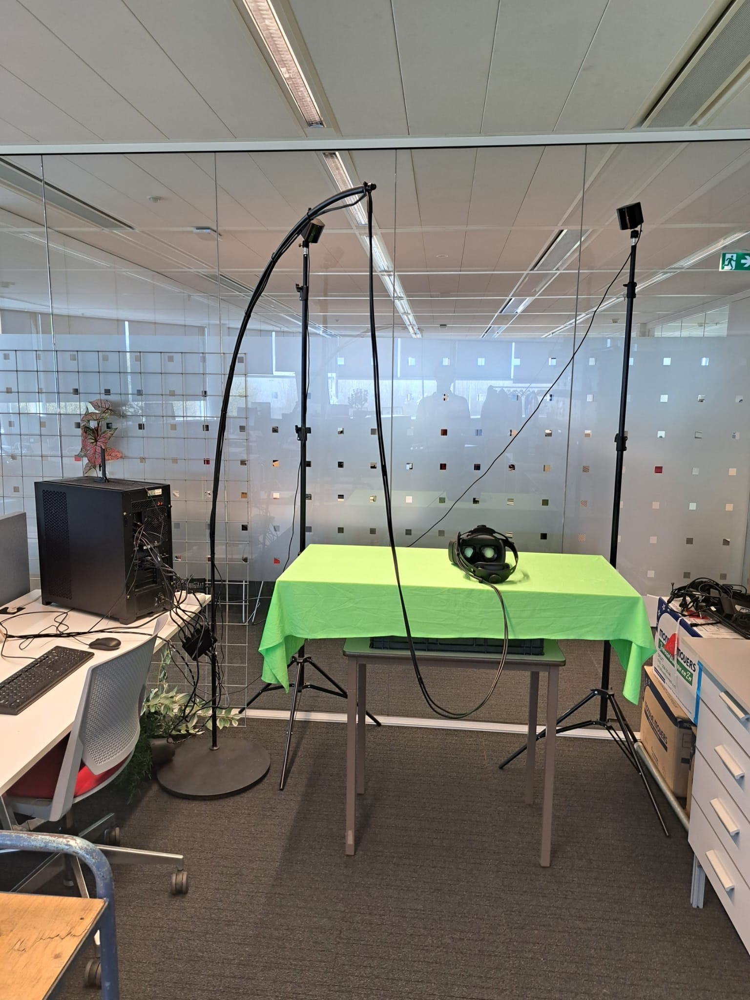

# How to calibrate Varjo XR-3 Headset

1. Turn on the PC and the headset.
2. Log in.
3. Open varjo base.
4. Open Steam VR in Systems menu.
5. Select Room Setup
6. Make sure headset is in the middle of the table.
7. Select Standing Only.
8. Click Next.
9. Select Calibrate Center.
10. Click next.
11. Select Calibrate floor.
12. Click next.
13. Click Done
14. Launch ARC-5 executable.

